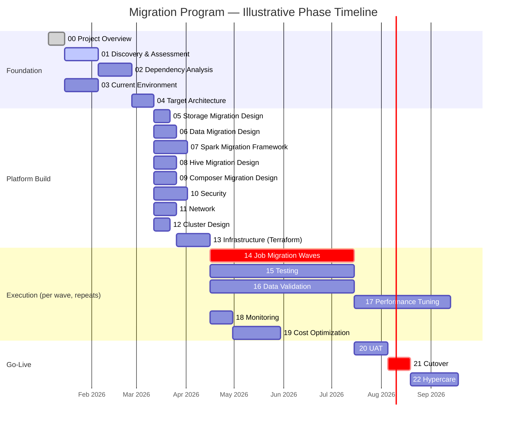

# Timeline & Phase Gates

**Purpose:** Define the sequence of phases, what must be true to exit each
phase (the "gate"), and how this maps to a real calendar for reporting
status upward.
**Owner:** Migration Program Lead.
**Inputs:** Migration charter, discovery findings (job counts and
complexity drive realistic phase durations).
**Outputs:** A gated plan used for status reporting and go/no-go decisions.
**Prerequisites:** Charter approved.
**Deliverables:** This document; a live project-tracking board (Jira/Linear/
equivalent) mirroring these phases.
**Risks:** Phases silently slipping without a gate to catch it; treating
phase numbers as strictly sequential when several are meant to overlap.
**Rollback:** N/A — planning artifact.
**Validation:** Each phase gate below is only considered passed when its
exit criteria are met and signed off per the RACI in
[`03-raci-matrix.md`](03-raci-matrix.md).
**Best Practices:** Report status against gates, not against dates — "Phase
5 gate not yet met" is more honest and more useful than "73% done."
**Lessons Learned:** Parallelizing phases that look independent (e.g.,
`10-security` and `11-network`) usually works; parallelizing phases with a
real dependency (e.g., starting `07-spark-migration` before
`02-dependency-analysis` is gated) reliably produces rework.
**Common Mistakes:** Setting a single hard end date without accounting for
the change-freeze windows in the charter — this creates unrealistic
pressure to cut over during a freeze window.
**Production Notes:** Durations below are illustrative planning defaults for
a mid-to-large ecommerce Hadoop estate (roughly 200–600 Spark jobs, 500+
Hive tables); recalibrate using the actual inventory counts from
[`01-discovery/`](../01-discovery/README.md) before committing dates
externally.

---

## Phase sequencing

Phases in **Foundation** must complete (gate passed) before wave-based
execution begins. Phases in **Platform Build** can run substantially in
parallel with each other once Foundation is gated. **Execution** phases run
per-wave, repeatedly, for the life of the migration. **Go-Live** phases
happen once, at the end.

> Treat the dates above as a **template**, not a commitment. Recompute
> durations once `01-discovery/` produces real job/table counts, and overlay
> the change-freeze windows from
> [`02-migration-charter.md`](02-migration-charter.md) before publishing an
> external timeline.

## Phase gates (entry/exit criteria)

| # | Phase | Entry criteria | Exit criteria (gate) |
|---|---|---|---|
| 00 | Project Overview | Exec sponsorship confirmed | Charter, RACI, timeline signed off |
| 01 | Discovery & Assessment | Phase 00 gated | All inventories complete; SLAs, DR/RPO/RTO documented and confirmed with stakeholders |
| 02 | Dependency Analysis | Phase 01 gated | Every in-scope job has a documented dependency graph; no "unknown" dependencies remain unresolved |
| 03 | Current Environment | Phase 01 gated (can run parallel to 02) | Full current-state resource/config/version inventory complete |
| 04 | Target Architecture | Phases 02 + 03 gated | Target architecture reviewed and approved by Platform + Security + Network leads |
| 05 | Storage Migration (design) | Phase 04 gated | HDFS→GCS strategy, validation approach, and rollback plan approved |
| 06 | Data Migration (design) | Phase 04 gated | Historical + incremental + CDC strategy approved per data domain |
| 07 | Spark Migration (framework) | Phase 04 gated | Shared library, packaging, and Dataproc submission pattern built and proven on 1 pilot job |
| 08 | Hive Migration (design) | Phase 04 gated | Metastore migration approach and per-table target (BQ vs Dataproc-Hive) decided |
| 09 | Composer Migration (design) | Phase 04 gated | DAG pattern and dynamic generation approach built and proven on 1 pilot pipeline |
| 10 | Security | Phase 04 gated | IAM model, Secret Manager, KMS design approved by Security |
| 11 | Network | Phase 04 gated | VPC/connectivity design approved by Network + Security |
| 12 | Cluster Design | Phase 04 gated | Cluster topology (ephemeral/persistent), sizing, autoscaling policy approved |
| 13 | Infrastructure (Terraform) | Phases 10, 11, 12 gated | Core Terraform modules built, reviewed, applied successfully to a non-prod project |
| 14 | Job Migration (execution) | Phase 13 gated | Wave plan approved; pilot wave migrated and validated |
| 15 | Testing | Runs continuously from Phase 13 onward | Test framework covers every job before it's declared migrated |
| 16 | Data Validation | Runs continuously from Phase 13 onward | Reconciliation framework operational and applied to every migrated dataset |
| 17 | Performance | Starts once jobs are running on GCP | Business-critical jobs meet or beat on-prem SLA |
| 18 | Monitoring | Phase 13 gated | Dashboards + alerts live before first production wave cuts over |
| 19 | Cost Optimization | Phase 18 gated | Cost baseline established; optimization backlog prioritized |
| 20 | UAT | All waves for a given cutover batch migrated + validated | Business sign-off obtained |
| 21 | Cutover | Phase 20 gated, outside freeze window | Go-live executed; validation passed; rollback window closed without rollback (or rollback executed cleanly) |
| 22 | Hypercare | Phase 21 complete | Stabilization period complete with no unresolved P1/P2; formal handover to steady-state ops |

## Status reporting cadence

- **Weekly**: Program Lead reports phase/gate status to Exec Sponsor and
  RACI-listed leads.
- **Daily during active cutover windows**: status reported per the
  [`21-cutover/`](../21-cutover/README.md) command center cadence.
- **Per wave**: a wave retro is logged in [`logs/`](../logs/README.md) after
  every job migration wave, feeding lessons learned back into
  [`documentation/`](../documentation/README.md).
