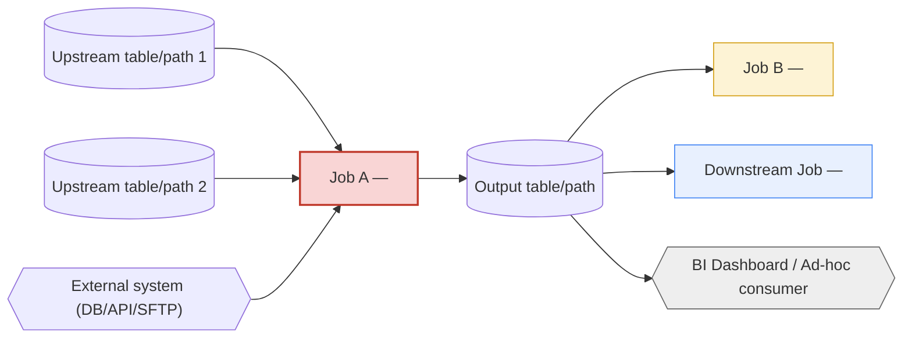

# Template — Dependency Graph (per Workflow/Job Cluster)

**Purpose:** A reusable Mermaid-based template for visualizing a job or
workflow bundle's full dependency graph — upstream inputs, downstream
consumers, and inter-job ordering — in a form reviewable by both engineers
and business stakeholders.
**Owner:** Whoever performs the dependency analysis for the job/bundle in
question (Platform or Data Engineering).
**When to use:** After completing the methodology steps in
[`../methodology/`](../methodology/) for a given job or tightly-coupled
job cluster (e.g., all jobs in one Oozie bundle).

---

## How to fill in this template

1. Copy the Mermaid block below into a new file named
   `dependency-graph-<job-or-bundle-id>.md` (co-located with the relevant
   phase documentation, or attached to the job's entry in
   [`01-discovery/inventories/06-job-inventory.md`](../../01-discovery/inventories/06-job-inventory.md)).
2. Replace each placeholder node with the real system/table/job name.
3. Use consistent node shapes: rectangles for jobs, cylinders for
   storage/tables, hexagons for external systems.
4. Color-code by criticality tier if helpful for review
   (`classDef` shown below).

## Template

## Companion table (machine-readable edge list)

Maintain the same graph as a plain edge-list table alongside the diagram —
this is what gets diffed over time to detect drift, since diagrams
themselves are hard to diff meaningfully.

| From | To | Relationship | Confirmed via (technique) | Confirmed date |
|---|---|---|---|---|
| `UpstreamSrc1` | `JobA` | read | Static code analysis | _(date)_ |
| `ExtSystem1` | `JobA` | JDBC read | Sqoop job definition | _(date)_ |
| `JobA` | `OutputTable` | write | Static code analysis | _(date)_ |
| `OutputTable` | `JobB` | read | Metastore query log | _(date)_ |
| `OutputTable` | `BIConsumer` | read (ad-hoc) | Data Consumers interview | _(date)_ |

## Validation checklist before considering a graph complete

- [ ] Every edge confirmed by at least one methodology technique from
      [`../methodology/`](../methodology/).
- [ ] Tier 1 job graphs confirmed by **at least two independent**
      techniques per edge.
- [ ] Full transitive closure traced (not just immediate neighbors) at
      least two hops in each direction.
- [ ] Reviewed by the job owner (developer interview) for accuracy.
