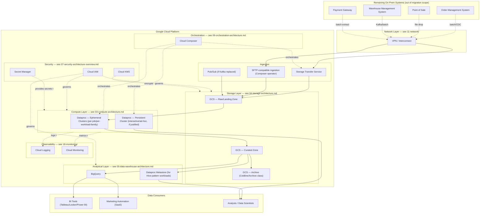

# Target Architecture Overview

**Purpose:** The single diagram and narrative every engineer on the program
should be able to point to and say "this is what we're building." Every
other document in this folder adds detail to one part of this picture.
**Owner:** Migration Program Lead + Platform Engineering.
**Inputs:** All of [`01-discovery/`](../01-discovery/README.md),
[`02-dependency-analysis/`](../02-dependency-analysis/README.md),
[`03-current-environment/`](../03-current-environment/README.md).
**Outputs:** The reference architecture that
[`13-infrastructure/`](../13-infrastructure/README.md) Terraform modules
implement.

---

## System diagram

## Design principles this architecture follows

1. **Managed services over self-managed infrastructure wherever the
   workload allows it.** Dataproc Metastore over a self-hosted MySQL-backed
   Metastore; Cloud Composer over self-hosted Airflow; BigQuery over
   Dataproc-Hive for analytical/BI-facing workloads. Every exception to
   this principle (i.e., every place we deliberately choose a self-managed
   pattern) is recorded as an ADR in
   [`09-architecture-decision-log.md`](09-architecture-decision-log.md)
   with an explicit justification.
2. **Ephemeral compute by default.** Dataproc clusters are created for a
   job or job-family's duration and torn down after, per
   [`03-compute-architecture.md`](03-compute-architecture.md) — this
   directly resolves pain point #1 (fixed capacity) and #3 (queue
   contention) from
   [`03-current-environment/09-pain-points-and-bottlenecks.md`](../03-current-environment/09-pain-points-and-bottlenecks.md).
3. **Per-workload data warehouse target, not a blanket rule.** See
   [`05-data-warehouse-architecture.md`](05-data-warehouse-architecture.md)
   for the explicit decision framework.
4. **Zero hardcoded configuration.** Every environment-specific value
   (project ID, bucket name, cluster name) is externalized via Terraform
   variables, Composer Variables, or Secret Manager — never hardcoded in
   job code, DAGs, or Terraform modules themselves. This directly resolves
   the hardcoded-dependency pain points surfaced throughout
   [`02-dependency-analysis/`](../02-dependency-analysis/README.md).
5. **Environment isolation by GCP project**, not shared-project namespacing
   — see [`02-landing-zone-and-project-structure.md`](02-landing-zone-and-project-structure.md).
6. **Security and network are designed in, not bolted on.** IAM, Secret
   Manager, KMS, and VPC design are first-class parts of this architecture
   from the start, addressed in detail in
   [`10-security/`](../10-security/README.md) and
   [`11-network/`](../11-network/README.md).

## What does NOT change in this migration

Per the charter's out-of-scope section
([`00-project-overview/02-migration-charter.md`](../00-project-overview/02-migration-charter.md)):
OMS, POS, WMS, and the payment gateway remain on-prem. This architecture
treats them as external systems reached over the network layer designed in
[`11-network/`](../11-network/README.md) — their internal architecture is
out of scope.

## Common Mistakes

- Treating this diagram as final and immutable — it should be revisited
  and versioned as later phases (especially
  [`12-cluster-design/`](../12-cluster-design/README.md) and
  [`13-infrastructure/`](../13-infrastructure/README.md)) surface
  implementation-level constraints that require adjustment. Track
  revisions in [`09-architecture-decision-log.md`](09-architecture-decision-log.md).
- Presenting this diagram to business stakeholders without translation —
  pair it with the plain-language narrative in
  [`00-project-overview/01-executive-summary.md`](../00-project-overview/01-executive-summary.md)
  when the audience isn't technical.

## Production Notes

The ingestion layer explicitly supports **parallel operation** with the
on-prem platform during the migration — GCS raw/landing zone buckets are
designed to receive data from both the legacy HDFS-based pipeline (via
[`05-storage-migration/`](../05-storage-migration/README.md) sync) and new
GCP-native ingestion simultaneously, which is required for the
parallel-run validation strategy in
[`14-job-migration/`](../14-job-migration/README.md).
