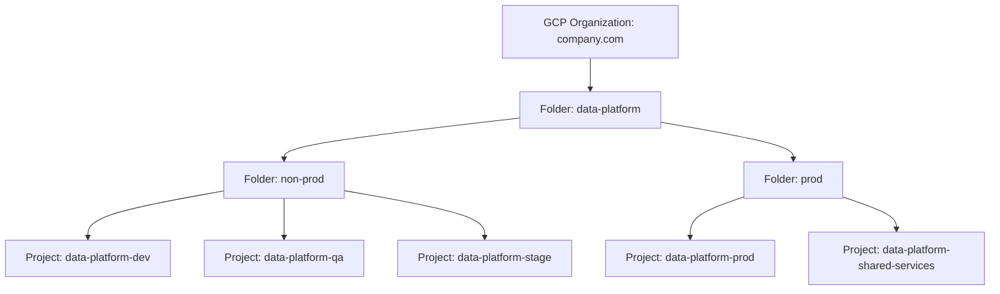

# Landing Zone & GCP Project Structure

**Purpose:** Define the GCP organizational hierarchy — organization,
folders, projects — and the environment isolation model this migration
will build on, satisfying constraint C4 (full environment isolation) from
[`00-project-overview/06-assumptions-and-constraints.md`](../00-project-overview/06-assumptions-and-constraints.md).
**Owner:** Cloud/DevOps lead, approved by Security.
**Inputs:** Confirmation of assumption A1 (existing landing zone or not),
company's existing GCP organizational structure if any other workloads
already run on GCP.

---

## Organization hierarchy

## Project purpose and isolation

| Project | Purpose | Who Has Access | Contains Production Data? |
|---|---|---|---|
| `data-platform-dev` | Active development, unit testing | Data/Platform Engineers (broad access within project) | No — synthetic/sampled data only |
| `data-platform-qa` | Integration testing, pre-release validation | Engineers + QA | Sampled/masked data only |
| `data-platform-stage` | Final pre-production validation, parallel-run target for cutover rehearsal | Engineers + QA + Program Lead | Limited — masked or explicitly approved real data for validation only |
| `data-platform-prod` | Production workloads | Least-privilege service accounts only; human access via break-glass, see [`10-security/`](../10-security/README.md) | Yes |
| `data-platform-shared-services` | Artifact Registry, Terraform state backend, CI/CD service accounts, shared monitoring | Cloud/DevOps + CI/CD service accounts | No |

Each environment project is a **fully separate GCP project** — not a
shared project with logical namespacing — per constraint C4. This ensures
IAM policies, quotas, and billing are cleanly separable and an incident or
misconfiguration in `dev` cannot cross-contaminate `prod`.

## Why not a shared project per environment tier

A shared-project model (e.g., one project with folder-prefixed resources
for dev/qa/stage) was considered and rejected because:

1. IAM bindings in GCP are most cleanly and auditable at the project level;
   namespacing within a project requires more complex conditional IAM
   policies that are harder to review and more error-prone.
2. Quota and billing separation is needed for
   [`19-cost-optimization/`](../19-cost-optimization/README.md) to
   attribute cost accurately per environment.
3. It matches constraint C4 in
   [`00-project-overview/06-assumptions-and-constraints.md`](../00-project-overview/06-assumptions-and-constraints.md)
   directly.

This decision is recorded formally as an ADR — see
[`09-architecture-decision-log.md`](09-architecture-decision-log.md).

## Naming convention

| Resource Type | Convention | Example |
|---|---|---|
| GCP Project ID | `<company>-data-platform-<env>` | `acme-data-platform-prod` |
| GCS Bucket | `<company>-<env>-<data-domain>-<zone>` | `acme-prod-pricing-curated` |
| Dataproc Cluster | `<data-domain>-<job-family>-<env>` | `pricing-nightly-prod` |
| Service Account | `svc-<data-domain>-<function>@<project>.iam.gserviceaccount.com` | `svc-pricing-etl@acme-data-platform-prod.iam.gserviceaccount.com` |
| Terraform Module | `<gcp-service>-<purpose>` | `dataproc-ephemeral-cluster` |

This naming convention is enforced by
[`13-infrastructure/`](../13-infrastructure/README.md) Terraform module
design (via variable validation) and referenced by every phase document
that names a resource, to keep the entire repository internally
consistent.

## Billing and quota

| Environment | Billing Account | Budget Alert Threshold | Quota Notes |
|---|---|---|---|
| `dev` / `qa` / `stage` | Same non-prod billing account (or sub-account) | 80% of monthly non-prod budget | Lower default quotas — intentionally constrains runaway dev/test cost |
| `prod` | Production billing account | 80%/95%/100% tiered alerts | Quota requests submitted proactively ahead of peak trading season, per [`19-cost-optimization/`](../19-cost-optimization/README.md) |

## Common Mistakes

- Provisioning `dev` with production-equivalent IAM permissions "to make
  development easier" — this defeats the purpose of environment isolation
  and is a common source of dev-environment credentials being reused
  inappropriately.
- Skipping the `stage` environment as "redundant with qa" — `stage` serves
  a distinct purpose (cutover rehearsal against production-like data
  volume) that `qa` does not, and is required by
  [`14-job-migration/`](../14-job-migration/README.md) wave validation.

## Production Notes

Request production quota increases (Dataproc, GCS, BigQuery slots if
applicable) well ahead of the first peak trading season on the new
platform — GCP quota increases can take days, and this must not become a
blocker discovered during
[`21-cutover/`](../21-cutover/README.md) planning for a Black Friday
launch window.
