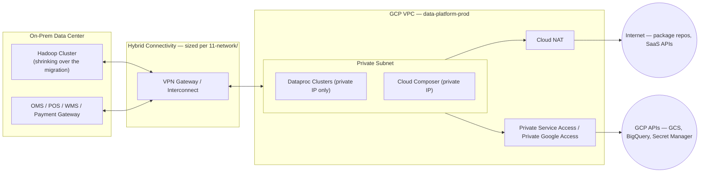

# Network Architecture Overview

**Purpose:** Establish the high-level connectivity design principles —
full detail (VPC layout, firewall rules, Cloud NAT, DNS, VPN/Interconnect
configuration) lives in [`11-network/`](../11-network/README.md); this
document ensures network design is visibly integrated with compute and
storage architecture from the start.
**Owner:** Network Engineering, reviewed by Security and Migration Program
Lead.
**Inputs:** [`01-discovery/questions/04-networking-team.md`](../01-discovery/questions/04-networking-team.md)
and
[`03-current-environment/05-storage-and-network-assessment.md`](../03-current-environment/05-storage-and-network-assessment.md)
findings, and the "stays on-prem" application list in
[`01-discovery/inventories/07-application-inventory.md`](../01-discovery/inventories/07-application-inventory.md).

---

## Design principles

1. **Private-by-default connectivity.** Dataproc clusters and Composer
   environments use private IPs only; no direct public internet exposure
   for compute resources. Egress for package installation, etc. goes
   through Cloud NAT.
2. **Hybrid connectivity sized for real transfer volume.** On-prem↔GCP
   connectivity (VPN vs. Dedicated/Partner Interconnect) is chosen based on
   the actual data volumes captured in
   [`01-discovery/inventories/11-storage-inventory.md`](../01-discovery/inventories/11-storage-inventory.md)
   and the parallel-run bandwidth needs of
   [`14-job-migration/`](../14-job-migration/README.md), not a default
   assumption.
3. **Every "stays on-prem" integration point gets an explicit, deliberately
   designed connectivity path** — see
   [`01-discovery/inventories/07-application-inventory.md`](../01-discovery/inventories/07-application-inventory.md)
   for the full list (OMS, POS, WMS, payment gateway) that must remain
   reachable.
4. **No CIDR range conflicts** between on-prem RFC1918 space and GCP VPC
   ranges, confirmed explicitly with Network Engineering per
   [`01-discovery/questions/04-networking-team.md`](../01-discovery/questions/04-networking-team.md)
   Q7.

## High-level connectivity diagram

## Connectivity method decision

| Requirement | Recommended Method | Rationale |
|---|---|---|
| Bulk historical data migration (one-time, high volume) | Storage Transfer Service (internet-based, HTTPS) or temporary Interconnect if volume/timeline demands it | See [`05-storage-migration/`](../05-storage-migration/README.md) for the full transfer strategy decision |
| Ongoing parallel-run and steady-state integration with on-prem systems | VPN (if volume/latency permits) or Dedicated/Partner Interconnect (if not) | Decision driven by actual measured requirements, not assumption — confirm during [`11-network/`](../11-network/README.md) |
| Partner/vendor SFTP integrations | Public internet with IP allowlisting and key-based auth (unchanged pattern, re-pointed to a GCP-hosted endpoint) | No need for private connectivity to third parties in most cases |

## Common Mistakes

- Assuming a single VPN will suffice without first confirming actual
  sustained transfer volume requirements against VPN throughput limits —
  see the storage volume figures in
  [`01-discovery/inventories/11-storage-inventory.md`](../01-discovery/inventories/11-storage-inventory.md).
- Designing network connectivity as an implementation detail decided
  during [`13-infrastructure/`](../13-infrastructure/README.md) instead of
  as an explicit architectural decision reviewed here first — Interconnect
  provisioning lead times (potentially months) make this a critical-path
  item that must be decided early.

## Production Notes

If Dedicated or Partner Interconnect is required (per the connectivity
method decision above), initiate the provisioning request during this
phase, not after [`04-target-architecture/`](README.md) is gated — lead
times for physical circuit provisioning are a common, easily-avoidable
source of program delay if not started early (see risk R9 in
[`00-project-overview/07-risk-register-summary.md`](../00-project-overview/07-risk-register-summary.md)).
