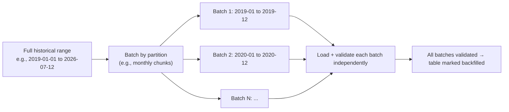

# Historical Data Migration Plan

**Purpose:** Define how large historical datasets are backfilled into
their GCP target without a single point-of-failure "big bang" load,
consistent with the batching principle referenced in the folder README.
**Owner:** Data Engineering.
**Inputs:** Table size and partition scheme from
[`01-discovery/inventories/09-hive-inventory.md`](../01-discovery/inventories/09-hive-inventory.md);
retention window from
[`01-discovery/inventories/04-data-retention-and-compliance.md`](../01-discovery/inventories/04-data-retention-and-compliance.md).

---

## Batching strategy

Historical backfill is batched by partition (typically date), not
attempted as a single load, for every table above a size threshold
(recommended: any table over 100 GB or with more than a trivial partition
count):

## Determining batch size

| Factor | Guidance |
|---|---|
| Table size | Larger tables → smaller batch windows (e.g., weekly instead of monthly) to keep each batch's load+validate cycle within a manageable time window (target: under 4 hours per batch) |
| Retention requirement | Only backfill data within the confirmed retention window from [`01-discovery/inventories/04-data-retention-and-compliance.md`](../01-discovery/inventories/04-data-retention-and-compliance.md) — do not backfill data that's due for compliant deletion/archival anyway |
| Query pattern of consumers | If most consumer queries only touch the last 13 months (per [`01-discovery/questions/08-data-consumers.md`](../01-discovery/questions/08-data-consumers.md)), prioritize backfilling recent data first, then work backward — this unblocks validation and even early consumer cutover sooner |

## Idempotency requirement

Every batch load must be safely re-runnable without producing duplicates —
implemented via `INSERT OVERWRITE`-equivalent semantics per partition
(BigQuery: `WRITE_TRUNCATE` per partition, or `MERGE`; Dataproc-Hive:
`INSERT OVERWRITE TABLE ... PARTITION (...)`) rather than blind append.
This directly follows the idempotency requirement established for all
migrated jobs in
[`07-spark-migration/`](../07-spark-migration/README.md) and applies
equally to migration-specific backfill jobs.

## Prioritization order

1. **Pilot table** (small, low-risk, Tier 3) — proves the batching and
   validation pattern end-to-end.
2. **Tables blocking early job migration waves** — per
   [`14-job-migration/`](../14-job-migration/README.md) wave sequencing.
3. **Tier 1 tables** — backfilled with the most conservative batch sizing
   and the fullest validation coverage, on a timeline that leaves buffer
   before their job's cutover date.
4. **Low-priority/rarely-queried historical tail data** — backfilled last,
   or evaluated for archive-only migration (compliant retention without
   active-format conversion) if genuinely low-value, per
   [`01-discovery/inventories/09-hive-inventory.md`](../01-discovery/inventories/09-hive-inventory.md)
   "zombie table" findings.

## Execution pattern (per batch)

1. Extract batch from source (already-migrated GCS raw zone, per
   [`05-storage-migration/`](../05-storage-migration/README.md)).
2. Apply format conversion per
   [`06-format-and-compression-strategy.md`](06-format-and-compression-strategy.md)
   and partition layout per
   [`05-partition-strategy.md`](05-partition-strategy.md).
3. Load into target (BigQuery load job or Dataproc-Hive `INSERT OVERWRITE`).
4. Run reconciliation for the batch per
   [`07-data-reconciliation-framework.md`](07-data-reconciliation-framework.md).
5. Mark batch complete in the migration tracker; proceed to next batch only
   after the current batch passes reconciliation.

## Common Mistakes

- Attempting to backfill years of history in a single job run "to save
  orchestration overhead" — a single massive job has a much higher chance
  of failing partway through, and diagnosing a partial failure in an
  unbatched load is significantly harder than re-running one failed batch.
- Backfilling data outside the confirmed retention window, wasting
  migration effort and cost on data that should be archived or dropped
  instead.

## Production Notes

For Tier 1 tables, run the pilot-table validation of this batching pattern
well before attempting the Tier 1 table's own backfill — do not use a
Tier 1 table as the first real-world test of the batching/reconciliation
mechanism itself.
