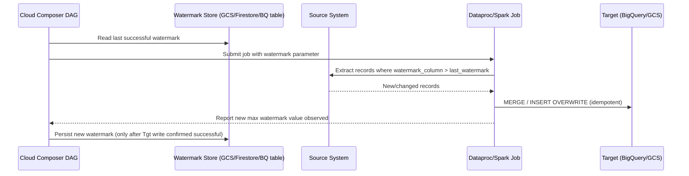

# Incremental Load Strategy

**Purpose:** Define the watermark-based pattern for ongoing incremental
data loads once a table has moved past its historical backfill — replacing
Sqoop's incremental-import mechanism and any custom on-prem incremental
logic with a deliberately re-examined, GCP-native equivalent.
**Owner:** Data Engineering.
**Inputs:** Sqoop incremental import configuration (watermark column,
last-value tracking mechanism) from
[`02-dependency-analysis/methodology/07-database-and-rest-api-dependencies.md`](../02-dependency-analysis/methodology/07-database-and-rest-api-dependencies.md).

---

## Why the on-prem watermark logic must be re-examined, not ported

Sqoop's incremental import (`--incremental append` or `--incremental
lastmodified`) tracks a watermark value (a max ID or max timestamp) in a
Sqoop metastore or an external tracking table. This mechanism has known
failure modes — clock skew between systems, late-arriving updates with an
older timestamp than the watermark, and soft-deletes not captured by an
append-only watermark — that may already be silently causing data quality
issues on-prem. Migrating this logic verbatim would carry those issues
forward. Instead, treat this as a deliberate redesign opportunity per job.

## Watermark pattern (standard)

The critical design point: **the watermark is only advanced after the
target write is confirmed successful**, not optimistically before — this
guarantees that a failed load can be safely retried from the same
watermark without data loss, and never advances past data that wasn't
actually persisted.

## Watermark storage

| Option | When to Use |
|---|---|
| A small BigQuery control table (`_migration_control.watermarks`) | Preferred default — queryable, auditable, easy to inspect/manually correct if needed |
| GCS object (JSON file per table) | Simpler for very low-volume/low-criticality tables |
| Airflow/Composer Variable | Avoid for anything beyond trivial cases — not designed for structured, auditable state tracking at scale |

## Handling known Sqoop-era failure modes explicitly

| Failure Mode | On-Prem Behavior (likely) | GCP-Native Redesign |
|---|---|---|
| Late-arriving records with a timestamp older than the current watermark | Silently missed by append-only watermark logic | Extract with a **lookback buffer** (e.g., re-extract the last 24 hours on every run, using `MERGE`/upsert semantics to avoid duplicates) rather than a hard cutoff |
| Soft-deletes in the source system | Often invisible to watermark-based extraction entirely | Explicitly confirm with the source system owner (per [`01-discovery/inventories/07-application-inventory.md`](../01-discovery/inventories/07-application-inventory.md)) whether deletes must be captured — if yes, this requires CDC, see [`03-cdc-strategy.md`](03-cdc-strategy.md), not a watermark-only approach |
| Clock skew between source and extraction system | Can cause records to be missed or duplicated near the boundary | Use the source system's own transaction/commit timestamp where available, not extraction-time wall-clock |

## Common Mistakes

- Copying the Sqoop watermark column and logic without asking the source
  system owner whether it's actually reliable (e.g., a "last_modified"
  column that isn't updated by every write path in the source application).
- Advancing the watermark before confirming the target write succeeded —
  this is the single most damaging mistake in incremental load design,
  since it silently and permanently loses the ability to recover missed
  data on retry.

## Production Notes

For Tier 1 tables (fraud, pricing, inventory), the lookback buffer
mitigation for late-arriving records is not optional — confirm explicitly
with the source system owner what the realistic maximum write-latency/
clock-skew window is, and size the buffer generously beyond that
confirmed figure, not just a guessed round number.
