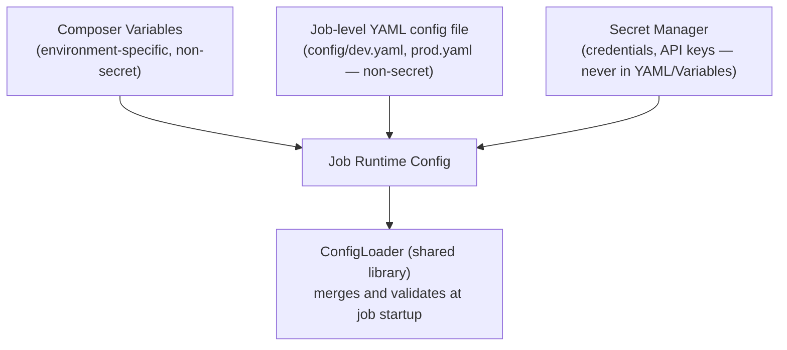

# Configuration Management & Secrets

**Purpose:** Define exactly how every environment-specific value and every
credential is externalized from code — the direct remediation for every
hardcoded value and plaintext credential found during
[`02-dependency-analysis/`](../02-dependency-analysis/README.md).
**Owner:** Platform Engineering, reviewed by Security for the secrets
handling portion.

---

## Configuration layering model



## What goes where

| Configuration Type | Storage | Example |
|---|---|---|
| GCP project ID, bucket names, cluster naming prefixes | Composer Variables, passed as job arguments | `--project-id`, `--env` |
| Job-specific business parameters (thresholds, feature flags) | Job-level YAML config file, version-controlled per environment | `pricing.discount_cap_percent: 40` |
| Database/API credentials | Secret Manager, referenced by secret name/version, never the value itself | `svc-pricing-etl-db-password` |
| Service account identity | Workload Identity Federation / attached service account on the Dataproc cluster — no key files distributed | N/A — identity-based, not credential-based |

## ConfigLoader pattern

See [`examples/config_loader.py`](examples/config_loader.py) for the full
working implementation. Every job's `main.py` starts with:

```python
from dp_spark_common.config.loader import ConfigLoader

config = ConfigLoader.load(env="prod", job_config_path="config/prod.yaml")
# config.get("pricing.discount_cap_percent") -> 40
# config.get_secret("db_password") -> resolved from Secret Manager, never logged
```

The `ConfigLoader` is responsible for:

1. Loading the environment-specific YAML file.
2. Resolving any `secret://<secret-name>` reference in the YAML to an
   actual Secret Manager lookup at runtime (never resolving secrets into
   the YAML file itself, which would defeat the purpose).
3. Validating required keys are present, failing fast with a clear error
   at job startup rather than a confusing failure deep in a transformation
   step.
4. **Never logging secret values** — the structured logger (see
   [`06-logging-and-error-handling.md`](06-logging-and-error-handling.md))
   is configured to redact any value resolved via `get_secret()`.

## Secret Manager conventions

| Convention | Rule |
|---|---|
| Naming | `<data-domain>-<purpose>-<env>` e.g. `pricing-db-password-prod` |
| Access | Scoped via IAM to only the specific service account(s) that need it — never a broad "all jobs can read all secrets" grant |
| Rotation | Per the rotation policy defined in [`10-security/`](../10-security/README.md); `ConfigLoader` always fetches the latest version, never pins a secret version, so rotation requires no job redeployment |
| Audit | Secret access is logged via Cloud Audit Logs by default — reviewed periodically per [`10-security/`](../10-security/README.md) |

## Migrating existing hardcoded values

For every hardcoded value flagged during
[`02-dependency-analysis/methodology/01-spark-job-dependencies.md`](../02-dependency-analysis/methodology/01-spark-job-dependencies.md)
analysis:

1. Classify: environment-specific config, business parameter, or secret.
2. Move to the appropriate layer above.
3. Confirm the job fails fast and clearly if the config value is missing
   (do not silently default to the old hardcoded value as a "safety net" —
   this defeats the purpose of externalization and can mask a
   misconfiguration).

## Common Mistakes

- Storing a secret's *value* in a Composer Variable or YAML file "because
  it's simpler" — Composer Variables and YAML config are not encrypted
  secret stores and must never contain actual credential values.
- Building a `ConfigLoader` that silently falls back to a hardcoded default
  when a config value is missing — this reintroduces exactly the hidden
  hardcoded value problem this pattern exists to eliminate, just one layer
  removed.

## Production Notes

For Tier 1 jobs, verify the fail-fast behavior explicitly in testing
(deliberately omit a required config value and confirm the job fails
immediately and clearly at startup, not partway through processing) — a
job that silently proceeds with missing configuration is a direct data
correctness risk.
