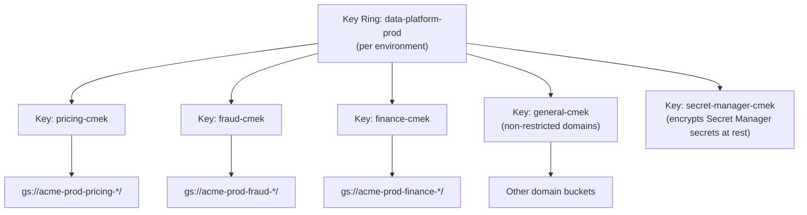

# KMS & Encryption Design

**Purpose:** Define the Cloud KMS key hierarchy and CMEK application
strategy per data classification, meeting or exceeding the encryption
baseline documented in
[`03-current-environment/06-security-configuration-assessment.md`](../03-current-environment/06-security-configuration-assessment.md).
**Owner:** Security Engineering.

---

## Key hierarchy

One KMS key per data domain classified Restricted or Confidential (per
[`01-discovery/inventories/04-data-retention-and-compliance.md`](../01-discovery/inventories/04-data-retention-and-compliance.md)),
rather than a single platform-wide key — this limits the blast radius of a
key compromise or misconfiguration to a single domain, and allows
independent rotation schedules and access policies per domain.

## CMEK application

| Resource Type | CMEK Applied? |
|---|---|
| GCS buckets (Restricted/Confidential domains) | Yes, per [`04-target-architecture/04-storage-architecture.md`](../04-target-architecture/04-storage-architecture.md) |
| BigQuery datasets (Restricted/Confidential domains) | Yes |
| Dataproc cluster persistent disks | Yes, for clusters processing Restricted/Confidential data |
| Secret Manager | Yes, platform-wide (all secrets are inherently sensitive) |
| GCS buckets (Internal/Public classification) | Google-managed encryption sufficient — CMEK adds operational overhead without a corresponding requirement |

## Key access policy

Each domain's KMS key grants `roles/cloudkms.cryptoKeyEncrypterDecrypter`
only to the service accounts and GCP services (e.g., the GCS/BigQuery
service agent) that need to use it for that domain — mirroring the
per-domain IAM scoping in
[`01-iam-design.md`](01-iam-design.md). No human user has standing
decrypt/encrypt access; key usage happens transparently through the
GCP service (GCS/BigQuery), not via direct key material access.

## Encryption in transit

All GCP API traffic uses TLS by default. For the hybrid connectivity path
to on-prem (per
[`04-target-architecture/08-network-architecture-overview.md`](../04-target-architecture/08-network-architecture-overview.md)),
confirm VPN/Interconnect traffic encryption meets or exceeds the current
on-prem RPC encryption baseline documented in
[`03-current-environment/06-security-configuration-assessment.md`](../03-current-environment/06-security-configuration-assessment.md).

## Common Mistakes

- Using a single platform-wide CMEK key for simplicity — this removes the
  ability to scope key access and rotation independently per data domain,
  undermining the least-privilege principle at the encryption layer.
- Applying CMEK universally, including to low-sensitivity domains, adding
  operational overhead (key management, rotation coordination) without a
  corresponding security benefit — apply CMEK where classification
  actually warrants it.

## Production Notes

Confirm the `fraud` and `finance` domain keys' access policies are
reviewed and approved by Security Engineering as a distinct, tracked
sign-off — these are the domains where a key access misconfiguration has
the most severe potential compliance consequence.
