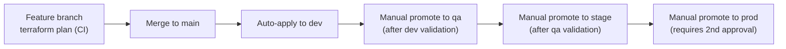

# Environment Promotion

**Purpose:** Define the sequence and gates for promoting a Terraform
change from `dev` through to `prod`, integrated with
[`ci-cd/`](../ci-cd/README.md).
**Owner:** Cloud/DevOps.

---

## Promotion sequence

## Gate criteria per stage

| Stage | Trigger | Gate to Proceed |
|---|---|---|
| `dev` | Automatic on merge to `main` | None — `dev` is the proving ground, failures here are expected and cheap |
| `qa` | Manual trigger, after `dev` is confirmed stable | `dev` apply succeeded; any automated integration tests relevant to the change pass |
| `stage` | Manual trigger, after `qa` validation | `qa` apply succeeded and was manually verified; change has been running in `qa` for a minimum soak period (recommended: 24-48 hours for non-trivial changes) |
| `prod` | Manual trigger, requires a second approver | `stage` apply succeeded and was verified; second reviewer has reviewed the `terraform plan` output; change is outside any active freeze window per [`00-project-overview/02-migration-charter.md`](../00-project-overview/02-migration-charter.md) |

## Why manual promotion between qa/stage/prod, not full automation

Given constraint C7 (on-prem cluster must remain fully operational
throughout) and the charter's freeze windows, `prod` infrastructure
changes need a deliberate, timed decision — not an automatic cascade the
moment `qa` passes. This is a conscious tradeoff: slower promotion in
exchange for controlled timing around business-sensitive periods.

## Rollback during promotion

If an issue is found at any stage, the promotion halts at that stage —
the change is not promoted further, and the prior stage's environment is
either left as-is (if the issue doesn't affect it) or rolled back via
`terraform apply` of the prior known-good configuration.

## Emergency change process

For a genuine production emergency requiring an infrastructure change
outside the normal promotion sequence (e.g., a security incident
requiring an immediate IAM binding change), an expedited path exists:
direct `prod` apply with retroactive two-person review within 24 hours —
this is the break-glass equivalent for infrastructure changes, used
rarely and always followed by the standard promotion sequence being
applied to formalize the change in `dev`/`qa`/`stage` afterward, so the
environments don't permanently diverge.

## Common Mistakes

- Treating the "manual" promotion gates as a formality clicked through
  without actually reviewing `qa`/`stage` validation results.
- Using the emergency change process for changes that aren't genuinely
  emergencies "to save time" — this erodes the safety the standard
  promotion sequence is designed to provide.

## Production Notes

Track every `prod` promotion (planned and emergency) in
[`logs/`](../logs/README.md) with the approver names and `terraform plan`
summary — this is both an operational record and useful input for
[`documentation/`](../documentation/README.md) post-implementation
reviews.
