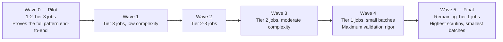

# Wave Planning

**Purpose:** The actual sequenced wave plan, built from the priority
matrix, respecting dependency order and charter freeze windows.
**Owner:** Migration Program Lead.

---

## Wave structure

## Wave sizing guidance

| Wave | Recommended Batch Size | Parallel-Run Duration (per [`04-parallel-run-strategy.md`](04-parallel-run-strategy.md)) |
|---|---|---|
| Wave 0 (pilot) | 1-2 jobs | 1-2 weeks — deliberately generous to fully validate the pattern |
| Wave 1-2 | 5-10 jobs | 3-5 days |
| Wave 3 | 5-8 jobs | 5-7 days |
| Wave 4 | 2-4 jobs | 1-2 weeks |
| Wave 5 (final Tier 1) | 1-3 jobs | 2-3 weeks, or longer if the Business Owner requests |

Batch size shrinks and parallel-run duration grows as tier increases —
this is intentional, not a scheduling inefficiency; the cost of a mistake
scales with criticality, and validation time should scale accordingly.

## Wave scheduling against the charter calendar

Every wave's proposed date range is checked against
[`00-project-overview/02-migration-charter.md`](../00-project-overview/02-migration-charter.md)
freeze windows before being finalized:

| Wave | Proposed Dates | Freeze Window Conflict? | Adjusted Dates |
|---|---|---|---|
| Wave 0 | _(fill in)_ | No | _(as proposed)_ |
| Wave 5 (final Tier 1, includes finance jobs) | _(fill in)_ | Check against quarter-end finance close freeze | Adjusted if needed |

## Wave composition example

| Wave | Jobs Included | Rationale |
|---|---|---|
| Wave 0 | `weekly_merchandising_adhoc_report` | No downstream dependents, no upstream dependencies, Tier 3 — ideal pilot |
| Wave 4 | `inventory_sync_intraday`, `pricing_nightly_batch` | Tier 1, but `inventory_sync_intraday`'s dependents (including `pricing_nightly_batch`) require it to migrate first or concurrently — sequenced together per the dependency graph |
| Wave 5 | `fraud_score_hourly`, `finance_gl_reconciliation` | Highest-sensitivity, lowest-tolerance-for-error jobs — migrated last, individually, with maximum scrutiny |

## Common Mistakes

- Building the wave plan once at program kickoff and never revisiting it
  as real progress and discoveries (new dependencies found, jobs taking
  longer than expected) change the picture.
- Scheduling a wave without explicitly checking every included job's
  dependency chain is fully satisfied by prior waves — a single missed
  dependency can block an entire wave at execution time.

## Production Notes

Review the wave plan against the priority matrix
([`01-priority-matrix.md`](01-priority-matrix.md)) weekly, and
specifically re-confirm Wave 4/5 dates against the charter calendar at
least 4 weeks before execution, giving time to adjust if a newly
announced business event creates a fresh freeze window conflict.
