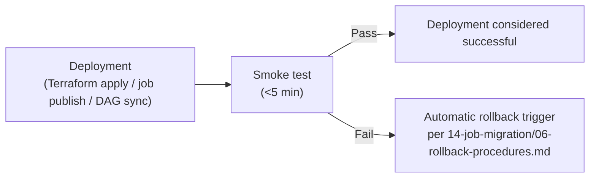

# Smoke Testing

**Purpose:** A fast, shallow sanity check run immediately after any
deployment (infrastructure, job code, or DAG) to catch obviously broken
changes before they cause a scheduled production failure hours later.
**Owner:** Platform Engineering, automated via
[`ci-cd/`](../ci-cd/README.md).

---

## What smoke tests check

| Deployment Type | Smoke Test |
|---|---|
| Terraform infrastructure change | Confirm the affected resource (bucket, cluster config, IAM binding) exists and is reachable/queryable as expected — not a full functional test, just "did this basic thing get created correctly" |
| Job package deployment | Submit a trivial, fast-running variant of the job (e.g., against a tiny 1-row test input) and confirm it completes successfully end-to-end |
| DAG deployment | Confirm the DAG parses without error and appears correctly in the Composer UI/API — catches syntax errors and import failures before the DAG's actual scheduled run |
| Shared library version bump | Run a minimal "import and call one function" check against the new version before it's relied upon by any job |

## Smoke test speed requirement

Smoke tests must complete in **under 5 minutes** — their value is in fast
feedback immediately post-deployment; a slow smoke test defeats the
purpose and will be skipped or ignored under time pressure.

## Smoke testing in the deployment pipeline

For `prod` deployments, a smoke test failure should trigger an automatic
rollback where feasible (e.g., reverting to the prior Terraform state or
job package version) rather than requiring a human to notice and decide.

## Common Mistakes

- Building smoke tests that are too shallow to catch anything meaningful
  ("the DAG file exists") or too deep to run quickly (essentially a full
  integration test) — smoke tests occupy a specific, narrow niche between
  the two.
- Not running smoke tests for infrastructure changes, only job/DAG
  deployments — a broken Terraform apply deserves the same fast feedback.

## Production Notes

Every Tier 1 job's smoke test should be specifically designed and
reviewed (not just a generic template) to catch that job's most likely
deployment-time failure mode, informed by what actually went wrong during
earlier testing phases for that job.
