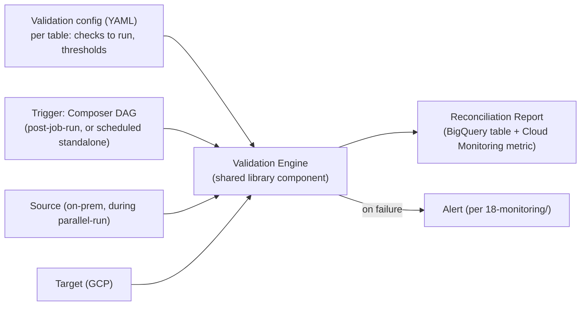

# Validation Framework Architecture

**Purpose:** Define how the automated validation framework is built and
triggered — a generic, config-driven Spark/BigQuery validation job usable
across any table, not a bespoke script per dataset.
**Owner:** Data Engineering.

---

## Architecture



## Validation config (per table)

```yaml
# validation-configs/pricing_daily_price_snapshot.yaml
table: pricing.daily_price_snapshot
target_platform: bigquery
checks:
  - type: row_count
    tolerance: 0
  - type: aggregate
    column: base_price
    function: sum
    tolerance: 0.01   # allows for float representation differences only
  - type: null_check
    columns: [sku, base_price, discount_percent]
    expected_null_count: 0
  - type: duplicate_check
    key_columns: [sku, dt]
  - type: business_rule
    rule: discount_percent_within_cap
    params:
      max_discount_percent: 40
schedule: post_job_run   # or a cron expression for standalone scheduled validation
severity_on_failure: critical   # tier-1 table
```

## Validation Engine (shared library component)

A generic, config-driven engine — `dp_spark_common.validation.engine` —
that reads a table's YAML config and executes the specified checks,
following the same dependency-injection and testability principles as
the rest of the shared library (per
[`07-spark-migration/08-oop-design-patterns.md`](../07-spark-migration/08-oop-design-patterns.md)).
Adding validation for a new table means writing a new YAML config, not new
code — this is what makes the framework scale across hundreds of tables
without a proportional increase in engineering effort.

## Trigger modes

| Mode | When Used |
|---|---|
| `post_job_run` | Composer DAG task appended immediately after a job's main task, validating that specific run's output |
| Scheduled standalone | For continuous production validation (per [`07-continuous-validation-in-production.md`](07-continuous-validation-in-production.md)), independent of any specific job run, e.g., a daily full-table check |
| On-demand | Triggered manually during investigation of a reported data issue |

## Common Mistakes

- Building a new bespoke validation script per table instead of extending
  the shared, config-driven engine — this recreates the same
  duplication-and-drift risk the shared Spark library principle exists to
  prevent.
- Setting tolerance to a loose value "to avoid false alarms" without
  understanding why a discrepancy exists — investigate root cause first,
  only relax tolerance for a confirmed, understood, and accepted source of
  variance (e.g., legitimate floating-point representation differences).

## Production Notes

The validation engine itself is Tier 1 shared infrastructure (used by
every Tier 1 table's validation) — apply the same rigorous testing
standard from
[`07-spark-migration/09-unit-testing-strategy.md`](../07-spark-migration/09-unit-testing-strategy.md)
to the engine's own code, given its wide blast radius if it silently fails
to catch a real issue.
