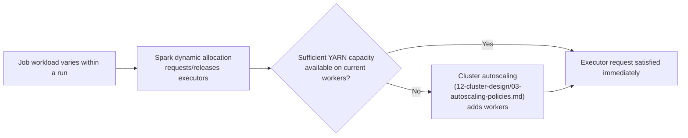

# Executor Sizing & Dynamic Allocation

**Purpose:** Fine-tune executor-level resource allocation within the
cluster sizing already established in
[`12-cluster-design/02-node-sizing-and-machine-types.md`](../12-cluster-design/02-node-sizing-and-machine-types.md)
— this document is about how a job uses the capacity it's given, not the
cluster capacity itself.
**Owner:** Platform Engineering.

---

## Executor sizing guidance

| Setting | Guidance |
|---|---|
| `spark.executor.cores` | 4-5 cores per executor is a common sweet spot — too few underutilizes JVM overhead per executor; too many (beyond ~5) can cause HDFS/GCS client throughput contention within a single executor |
| `spark.executor.memory` | Sized from actual measured job memory usage (per [`01-discovery/inventories/08-spark-inventory.md`](../01-discovery/inventories/08-spark-inventory.md) on-prem baseline, adjusted based on [`15-testing/08-performance-testing-overview.md`](../15-testing/08-performance-testing-overview.md) results) — avoid both under-provisioning (causing spill/OOM) and over-provisioning (wasting cluster capacity and cost) |
| `spark.executor.memoryOverhead` | Default (10% of executor memory, minimum 384MB) is usually adequate; increase for jobs with heavy off-heap usage (e.g., significant PySpark UDF usage, which uses off-heap Python process memory) |

## Dynamic allocation

```
spark.dynamicAllocation.enabled = true
spark.dynamicAllocation.minExecutors = <job-family-specific minimum>
spark.dynamicAllocation.maxExecutors = <job-family-specific maximum>
spark.dynamicAllocation.executorIdleTimeout = 60s
```

Dynamic allocation lets Spark request/release executors within a single
job run based on actual workload (e.g., fewer executors needed during an
initial small read, more during a large shuffle stage) — complementary to,
not a replacement for, the cluster-level autoscaling in
[`12-cluster-design/03-autoscaling-policies.md`](../12-cluster-design/03-autoscaling-policies.md),
which scales the underlying YARN NodeManager capacity dynamic allocation
draws from.

## Relationship between dynamic allocation and cluster autoscaling



Both layers working together is what enables the ephemeral,
right-sized-per-job pattern established in
[`04-target-architecture/03-compute-architecture.md`](../04-target-architecture/03-compute-architecture.md)
— dynamic allocation handles fine-grained, within-run elasticity; cluster
autoscaling handles coarser, worker-count elasticity.

## Common Mistakes

- Setting `spark.dynamicAllocation.minExecutors` too high, defeating the
  purpose of dynamic allocation by keeping unnecessary executors alive
  throughout the job even during low-demand phases.
- Setting `executorIdleTimeout` too low for jobs with naturally bursty,
  intermittent processing patterns, causing executors to be released and
  immediately re-requested repeatedly, adding unnecessary overhead.

## Production Notes

For Tier 1 job families, validate dynamic allocation and cluster
autoscaling working together under a realistic, variable load pattern
(not a flat/constant synthetic load) during
[`15-testing/08-performance-testing-overview.md`](../15-testing/08-performance-testing-overview.md)
— confirm the combined system scales up fast enough to avoid an SLA
breach during a real load spike.
