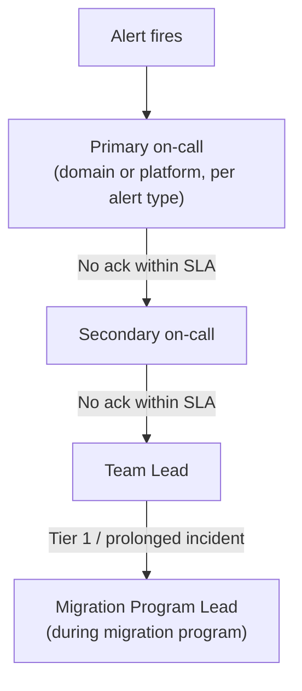

# On-Call & Escalation

**Purpose:** Define the on-call model for the new platform — an
improvement on the current on-prem rotation and escalation path
documented in
[`01-discovery/questions/07-operations.md`](../01-discovery/questions/07-operations.md)
Q6.
**Owner:** Platform Engineering + Operations.

---

## On-call structure

| Rotation | Scope | Escalation |
|---|---|---|
| Platform on-call | Infrastructure-level issues (Dataproc, Composer, network, IAM) | First responder for any platform-wide alert |
| Domain on-call (pricing, fraud, finance, etc.) | Job-specific failures and data quality issues for that domain | First responder for domain-specific alerts, per the DAG `owner` routing in [`03-alerting-strategy.md`](03-alerting-strategy.md) |
| Security on-call | Security-relevant alerts (audit anomalies, secret rotation failures) | First responder for security alerts |

## Escalation path

Acknowledgment SLA: 15 minutes for Critical alerts, 4 hours for Warning
alerts during business hours — tuned to be meaningfully faster than the
MTTD/MTTR baseline documented in
[`01-discovery/questions/07-operations.md`](../01-discovery/questions/07-operations.md),
not just copied from it.

## During active migration (wave execution and cutover)

During an active cutover window (per
[`21-cutover/`](../21-cutover/README.md)), on-call coverage for the
affected domain is elevated — a dedicated engineer actively monitoring,
not just standard passive on-call rotation — for the duration of the
cutover window plus the initial hypercare period.

## Runbook integration

Every alert links directly to its corresponding runbook in
[`runbooks/`](../runbooks/README.md) — an on-call engineer receiving an
alert should never need to search for "what do I do about this," the
alert itself points to the answer.

## Common Mistakes

- Designing an on-call rotation without clear escalation timing, leaving
  ambiguity about when to escalate versus keep trying to resolve solo.
- Not adjusting on-call coverage during active cutover windows, treating
  every day as equivalent risk when cutover days are specifically
  elevated-risk.

## Production Notes

Rehearse the escalation path explicitly at least once before the first
Tier 1 cutover (a planned drill, not a real incident) — confirm every
step in the chain actually knows their role and the tooling (paging,
Slack routing) works as configured.
