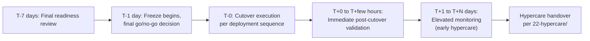

# Go-Live Plan

**Purpose:** The overall plan for a cutover event — what's happening, when,
and what "success" looks like — the document every other document in this
folder supports.
**Owner:** Migration Program Lead.

---

## Go-live plan template (per cutover event — job or wave)

| Field | Detail |
|---|---|
| Cutover Event | Job(s)/wave being cut over |
| Date/Time (start) | Confirmed outside freeze window per [`00-project-overview/02-migration-charter.md`](../00-project-overview/02-migration-charter.md) |
| Expected Duration | |
| Command Center Lead | |
| Rollback Decision Authority | Per RACI — Migration Program Lead has standing authority |
| Success Criteria | Specific, measurable — e.g., "job completes on GCP schedule, passes post-cutover validation, no P1/P2 within first 3 runs" |
| Rehearsal Completed | Date of `stage` rehearsal, per [`05-deployment-sequence.md`](05-deployment-sequence.md) |

## Go-live phases

## Final go/no-go review (T-1 day)

A formal go/no-go decision is made the day before cutover, confirming:

- [`14-job-migration/07-production-deployment-checklist.md`](../14-job-migration/07-production-deployment-checklist.md)
  fully satisfied.
- No new blocking issue has emerged since UAT sign-off.
- Rollback plan confirmed ready and rehearsed.
- Command center staffed and briefed.
- No unexpected event (e.g., an unplanned on-prem incident, a newly
  announced business event) creates new risk.

A "no-go" decision reschedules the cutover — this is not treated as a
failure; proceeding with unresolved doubt is the actual failure mode to
avoid.

## Common Mistakes

- Treating the go/no-go review as a formality once the date is on the
  calendar, rather than a genuine decision point where "no-go" is a live
  option.
- Not defining specific, measurable success criteria in advance, making
  it unclear after the fact whether the cutover actually succeeded.

## Production Notes

For Tier 1 cutovers, the go/no-go review should include the Business
Owner, not just engineering — a business-side "no-go" veto (e.g., an
unexpected urgent business need for stability that week) should carry the
same weight as a technical one.
