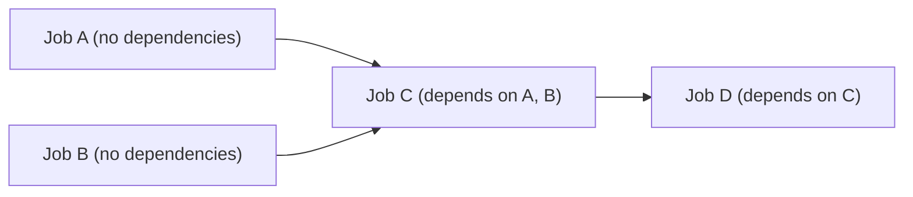

# Deployment Sequence

**Purpose:** The exact, step-by-step technical execution order for a
cutover — rehearsed in `stage` before being executed for real.
**Owner:** Platform Engineering (Technical Executor).

---

## Standard deployment sequence (per job)

1. **Final pre-cutover validation** — confirm parallel-run reconciliation
   still passing as of right now (not just historically), per
   [`16-data-validation/`](../16-data-validation/README.md).
2. **Pre-cutover snapshot** — per
   [`06-data-migration/04-snapshot-strategy.md`](../06-data-migration/04-snapshot-strategy.md),
   giving a clean rollback reference point.
3. **Disable the on-prem scheduler entry** (pause, don't delete — per the
   decommissioning gate in
   [`05-storage-migration/07-rollback-procedure.md`](../05-storage-migration/07-rollback-procedure.md)),
   preventing dual-write/dual-processing confusion once GCP becomes system
   of record.
4. **Enable the Composer DAG for production scheduling** (if not already
   enabled in a "shadow"/parallel-run-only mode).
5. **Redirect downstream consumers** — update any BI tool connection,
   dependent DAG, or partner integration to point at the GCP output
   location, per the specific job's downstream consumer list (per
   [`02-dependency-analysis/methodology/09-downstream-consumer-analysis.md`](../02-dependency-analysis/methodology/09-downstream-consumer-analysis.md)).
6. **Monitor the first production run closely** — command center actively
   watching, not just passively waiting for an alert.
7. **Post-cutover validation** — per
   [`07-post-cutover-validation.md`](07-post-cutover-validation.md).

## Multi-job wave deployment sequence

For a wave cutting over multiple jobs together, sequence per the
dependency graph (per
[`02-dependency-analysis/`](../02-dependency-analysis/README.md)) —
upstream jobs cut over before or simultaneously with their downstream
dependents, never after.

Cutover order: A and B (parallel) → C → D.

## Rehearsal requirement

Every deployment sequence is rehearsed **exactly as written** in `stage`
at least once before the real `prod` cutover — the rehearsal validates
both the sequence itself and the actual time each step takes, informing
the go-live plan's expected duration.

## Common Mistakes

- Deviating from the rehearsed sequence during the real cutover "to save
  time," reintroducing exactly the risk the rehearsal was meant to
  eliminate.
- Redirecting downstream consumers before confirming the GCP job's first
  production run actually succeeded, creating a window where consumers
  might read incomplete or stale data.

## Production Notes

For Tier 1 jobs, insert an explicit pause-and-confirm checkpoint between
step 6 (monitor first run) and step 5 becoming fully effective for all
consumers if technically feasible (e.g., a phased consumer cutover) —
reducing the blast radius if the first production run reveals an
unexpected issue.
