# On-Prem Hadoop → Google Cloud Platform Migration Playbook

**Ecommerce Data Platform Migration Execution Repository**

---

## What this repository is

This is **not** a tutorial, a proof-of-concept, or a learning resource. It is a
**migration execution playbook** — the actual set of documents, templates,
Terraform modules, scripts, DAGs, and runbooks a Principal Data Platform
Engineer would hand to an enterprise migration team to execute a real,
production, revenue-impacting migration of an ecommerce company's on-prem
Hadoop data platform to Google Cloud Platform.

Every document in this repository assumes the migration is actually
happening: real stakeholders will read it, real engineers will execute the
steps in it, real customers will be affected if it goes wrong, and real
auditors may ask to see it. Nothing here is illustrative filler.

### Source platform being migrated

| Component | Technology |
|---|---|
| Compute cluster | On-prem Hadoop (YARN) |
| Processing engine | Apache Spark |
| Data warehouse layer | Apache Hive + Hive Metastore |
| Distributed storage | HDFS |
| Orchestration | Oozie / Airflow / Cron (mixed, site-dependent) |
| Streaming (where present) | Kafka |
| RDBMS ingestion (where present) | Sqoop |
| Automation | Shell scripts, shared internal libraries |
| Security | On-prem Kerberos / Ranger / LDAP-based security |

### Target platform

| Component | GCP Service |
|---|---|
| Object storage | Cloud Storage (GCS) |
| Processing engine | Dataproc (Spark on GCP) |
| Analytical warehouse | BigQuery (where applicable) |
| Orchestration | Cloud Composer (managed Airflow) |
| Identity & access | Cloud IAM |
| Secrets | Secret Manager |
| Encryption | Cloud KMS |
| Observability | Cloud Logging + Cloud Monitoring |
| CI/CD | Cloud Build and/or GitHub Actions |
| Infrastructure as Code | Terraform |
| Container/artifact hosting | Artifact Registry |
| Data governance (where applicable) | Dataplex |

---

## How to use this repository

1. **Start at [`00-project-overview/`](00-project-overview/README.md)** to
   understand scope, charter, stakeholders, and the phase-gate timeline.
2. **Follow the numbered phase folders (`01-` through `22-`) in order.**
   They are numbered because they are meant to be executed roughly in that
   sequence — later phases assume earlier phases produced their documented
   deliverables (e.g., `07-spark-migration` assumes `02-dependency-analysis`
   already produced a complete Spark job dependency inventory).
3. **Cross-cutting folders** (`architecture/`, `diagrams/`, `terraform/`,
   `scripts/`, `templates/`, `sample-config/`, `sample-code/`, `ci-cd/`,
   `documentation/`, `checklists/`, `runbooks/`, `decisions/`, `logs/`) are
   referenced *from* the numbered phases rather than executed in sequence.
   They hold reusable assets — Terraform modules, ADRs, checklists, runbooks
   — that multiple phases depend on.
4. **Track build status** in [`MIGRATION-PROGRESS.md`](MIGRATION-PROGRESS.md).
   This repository is built incrementally, one folder at a time, to
   production quality. A folder marked 🚧 Pending has a placeholder README
   only; do not execute against it yet.
5. **Every document follows a consistent metadata contract** so any engineer
   can drop into any phase document and immediately know how to use it (see
   below).

---

## Document contract

Every execution-oriented document in this repository (phase guides,
runbooks, checklists) is written against the same structure, so the
playbook reads consistently regardless of who authored a given page:

| Section | What it answers |
|---|---|
| **Purpose** | Why this document exists and what decision or action it drives |
| **Owner** | The role (not name) accountable for this document staying current |
| **Inputs** | What must exist before this work can start |
| **Outputs** | What this work produces, and who consumes it downstream |
| **Prerequisites** | Technical/organizational gates that must be cleared first |
| **Deliverables** | The concrete artifacts produced (files, sign-offs, dashboards) |
| **Risks** | What can go wrong executing this, and likelihood/impact |
| **Rollback** | How to undo this step if it fails partway |
| **Validation** | How we prove this step actually worked |
| **Best Practices** | What experienced teams do that inexperienced teams skip |
| **Lessons Learned** | What has bitten real migrations doing this exact step |
| **Common Mistakes** | The specific errors this document exists to prevent |
| **Production Notes** | Ecommerce-specific considerations (peak traffic, SLAs, PII) |

Reference/inventory/glossary-style documents use a lighter-weight version of
this contract (Purpose, Owner, Inputs, Outputs) since concepts like
"Rollback" don't apply to a glossary entry.

---

## Repository structure

```mermaid
flowchart TD
    subgraph Foundation["Foundation — Understand Before You Touch Anything"]
        P00["00-project-overview<br/>Charter, RACI, timeline"]
        P01["01-discovery<br/>Stakeholder Q&A, inventories, SLAs"]
        P02["02-dependency-analysis<br/>Job/data/library dependency graphs"]
        P03["03-current-environment<br/>Hadoop/Spark/Hive/YARN assessment"]
        P04["04-target-architecture<br/>GCP target state design"]
    end

    subgraph Platform["Platform Migration"]
        P05["05-storage-migration<br/>HDFS to GCS"]
        P06["06-data-migration<br/>Historical + incremental + CDC"]
        P07["07-spark-migration<br/>Code, packaging, Dataproc"]
        P08["08-hive-migration<br/>Metastore, tables, UDFs"]
        P09["09-composer-migration<br/>Oozie/Cron/Airflow to Composer"]
    end

    subgraph Platform2["Platform Foundations"]
        P10["10-security<br/>IAM, Secret Manager, KMS"]
        P11["11-network<br/>VPC, firewall, private access"]
        P12["12-cluster-design<br/>Dataproc cluster strategy"]
        P13["13-infrastructure<br/>Terraform IaC"]
    end

    subgraph Execution["Migration Execution"]
        P14["14-job-migration<br/>Wave planning, execution"]
        P15["15-testing<br/>Unit/integration/regression/chaos"]
        P16["16-data-validation<br/>Reconciliation framework"]
        P17["17-performance<br/>Spark + Dataproc tuning"]
        P18["18-monitoring<br/>Dashboards, alerts, SLOs"]
        P19["19-cost-optimization<br/>Autoscaling, spot, storage classes"]
    end

    subgraph GoLive["Go-Live"]
        P20["20-uat<br/>Business sign-off"]
        P21["21-cutover<br/>Go-live execution"]
        P22["22-hypercare<br/>Post go-live stabilization"]
    end

    subgraph Support["Cross-Cutting Support (referenced by all phases)"]
        ARCH["architecture/ + diagrams/"]
        TF["terraform/"]
        SCRIPTS["scripts/ + sample-config/ + sample-code/"]
        TMPL["templates/"]
        CICD["ci-cd/"]
        DOCS["documentation/ + decisions/"]
        OPS["checklists/ + runbooks/ + logs/"]
    end

    Foundation --> Platform --> Platform2 --> Execution --> GoLive
    Support -.referenced by.-> Foundation
    Support -.referenced by.-> Platform
    Support -.referenced by.-> Platform2
    Support -.referenced by.-> Execution
    Support -.referenced by.-> GoLive
```



### Full folder listing

```
big-data-onprem-job-migration-to-gcp/
├── 00-project-overview/       Charter, RACI, timeline, glossary, scope
├── 01-discovery/              Stakeholder Q&A, SLAs, inventories, DR/RPO/RTO
├── 02-dependency-analysis/    Dependency identification methodology + templates
├── 03-current-environment/    Hadoop/Spark/Hive/YARN environment assessment
├── 04-target-architecture/    Target GCP architecture and design decisions
├── 05-storage-migration/      HDFS → GCS migration strategy
├── 06-data-migration/         Historical, incremental, CDC data migration
├── 07-spark-migration/        Spark code migration, Dataproc, patterns, code
├── 08-hive-migration/         Hive Metastore, tables, UDFs migration
├── 09-composer-migration/     Oozie/Cron/Airflow → Cloud Composer
├── 10-security/                IAM, Secret Manager, KMS, encryption, audit
├── 11-network/                 VPC, firewall, NAT, DNS, connectivity
├── 12-cluster-design/          Dataproc cluster architecture and sizing
├── 13-infrastructure/          Terraform structure for this migration
├── 14-job-migration/           Wave planning, migration tracker, execution
├── 15-testing/                 Full test strategy across all test types
├── 16-data-validation/         Reconciliation and validation framework
├── 17-performance/             Spark/Dataproc performance tuning
├── 18-monitoring/              Cloud Monitoring/Logging, dashboards, alerts
├── 19-cost-optimization/       Autoscaling, spot VMs, storage tiering
├── 20-uat/                     UAT execution, sign-off, acceptance criteria
├── 21-cutover/                 Go-live plan, command center, rollback
├── 22-hypercare/               Post-go-live stabilization and handover
├── architecture/                Cross-cutting architecture references
├── diagrams/                    Mermaid diagram library
├── terraform/                   Reusable Terraform modules
├── scripts/                     Reusable operational scripts
├── templates/                   Reusable document/inventory templates
├── sample-config/                Reference configuration files
├── sample-code/                  Reference code (Spark jobs, DAGs)
├── ci-cd/                        CI/CD pipeline design and pipeline-as-code
├── documentation/                ADRs, guides, registers, project plan
├── checklists/                   Cross-phase execution checklists
├── runbooks/                     Operational runbooks
├── decisions/                    Architecture Decision Record log
├── logs/                         Execution/cutover log archive
├── MIGRATION-PROGRESS.md         Build status tracker for this repository
└── README.md                     This file
```

---

## Coding & documentation standards

All code in this repository (Terraform, Python, PySpark, Airflow DAGs, shell)
follows:

- **SOLID principles** and clean architecture — single-responsibility modules,
  dependency inversion for I/O (readers/writers behind interfaces), no god
  classes.
- **Configuration-driven design** — no hardcoded project IDs, bucket names,
  cluster names, table names, or credentials anywhere in code. Everything
  comes from environment-scoped config (Cloud Composer Variables, Secret
  Manager, `.tfvars`, or job-level YAML/JSON config).
- **Structured logging** — JSON-structured logs with correlation/run IDs,
  compatible with Cloud Logging's structured log ingestion.
  * Exception handling that distinguishes retryable errors (transient GCS
  429s, YARN preemption) from terminal errors (schema mismatch, missing
  partition) — see [`07-spark-migration/`](07-spark-migration/README.md).
- **Environment separation** — every environment (`dev`, `qa`, `stage`,
  `prod`) has its own GCP project, its own Terraform state, and its own
  service accounts. Nothing crosses environment boundaries implicitly.
- **Type hints** in all Python code; **explicit schemas** (not inferred) for
  all Spark DataFrame I/O in production jobs.
- **Reusable utilities over duplication** — shared Spark session builders,
  config loaders, and GCS/BQ I/O helpers live in a shared internal library
  (see [`07-spark-migration/`](07-spark-migration/README.md)), not copy-pasted
  per job.

---

## Who this repository is for

| Role | How you use this repository |
|---|---|
| **Migration Program Lead** | `00-project-overview/`, `documentation/`, `14-job-migration/`, `21-cutover/` |
| **Data Platform / Spark Engineers** | `02-`, `05-`, `06-`, `07-`, `08-`, `12-`, `17-`, `sample-code/` |
| **Platform/DevOps/SRE** | `10-`, `11-`, `12-`, `13-`, `18-`, `19-`, `ci-cd/`, `terraform/` |
| **QA / Test Engineers** | `15-`, `16-`, `20-` |
| **Security & Compliance** | `01-` (security questions), `10-`, `documentation/` (risk register) |
| **Business Stakeholders / Data Consumers** | `00-`, `20-uat/`, `21-cutover/` communication plan |
| **Operations / Hypercare team** | `21-`, `22-`, `runbooks/`, `checklists/` |

---

## Status

See [`MIGRATION-PROGRESS.md`](MIGRATION-PROGRESS.md) for the live build
status of every folder in this repository. This repository is built
incrementally and to production depth — a folder is only marked complete
when its documentation is something you could actually execute a real
migration step against.
