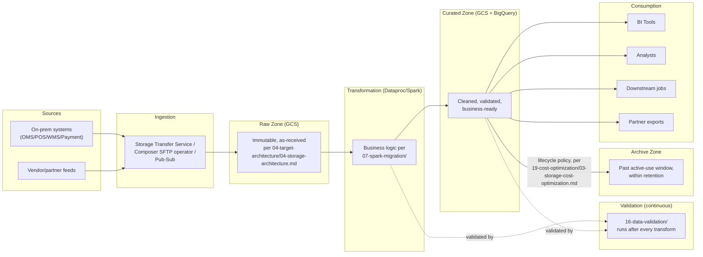

# End-to-End Data Flow Diagram

**Purpose:** Show how data actually moves through the platform, end to
end, across every zone and transformation stage — complementing the
system context diagram's system-level view with a data-lifecycle view.
**Owner:** Migration Program Lead / Data Engineering.

---

## Where each stage is detailed

| Stage | Detailed In |
|---|---|
| Ingestion | [`05-storage-migration/`](../05-storage-migration/README.md), [`06-data-migration/`](../06-data-migration/README.md) |
| Raw/Curated/Archive zoning | [`04-target-architecture/04-storage-architecture.md`](../04-target-architecture/04-storage-architecture.md) |
| Transformation | [`07-spark-migration/`](../07-spark-migration/README.md) |
| Validation | [`16-data-validation/`](../16-data-validation/README.md) |
| Consumption patterns | [`01-discovery/questions/08-data-consumers.md`](../01-discovery/questions/08-data-consumers.md), [`04-target-architecture/05-data-warehouse-architecture.md`](../04-target-architecture/05-data-warehouse-architecture.md) |

## Common Mistakes

- Treating this as a per-job diagram — it's intentionally the aggregate,
  cross-domain flow; individual job dependency graphs live in
  [`02-dependency-analysis/templates/01-dependency-graph-template.md`](../02-dependency-analysis/templates/01-dependency-graph-template.md).

## Production Notes

Use this diagram in stakeholder communication (e.g., alongside
[`00-project-overview/01-executive-summary.md`](../00-project-overview/01-executive-summary.md))
when explaining the platform's shape to a non-engineering audience — it's
deliberately less detailed than the target architecture overview, making
it more approachable for that purpose.
