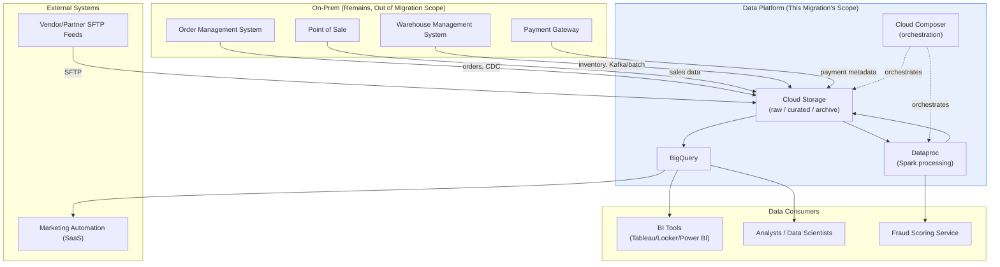

# System Context Diagram

**Purpose:** The single "zoomed all the way out" view of this platform's
boundary — every system it exchanges data with, on-prem and external,
regardless of migration phase. Useful for onboarding (per
[`documentation/onboarding-guide.md`](../documentation/onboarding-guide.md))
and for any stakeholder conversation needing the full picture without
implementation detail.
**Owner:** Migration Program Lead.

---

## Boundary notes

- Everything inside the **Platform** box is what this migration builds —
  see [`04-target-architecture/01-target-architecture-overview.md`](../04-target-architecture/01-target-architecture-overview.md)
  for the detailed internal architecture.
- Everything in **On-Prem Remaining** stays exactly where it is per the
  charter's out-of-scope section
  ([`00-project-overview/02-migration-charter.md`](../00-project-overview/02-migration-charter.md))
  — this migration changes *how* the platform connects to them (per
  [`11-network/`](../11-network/README.md)), not the systems themselves.
- The **Fraud Scoring Service** is shown as a consumer since it's
  downstream of the `fraud_score_hourly` pipeline — confirm its own
  hosting location (on-prem or GCP) per
  [`01-discovery/inventories/07-application-inventory.md`](../01-discovery/inventories/07-application-inventory.md),
  since this affects whether it's "external" or part of the platform
  boundary itself.

## Keeping this current

Update this diagram whenever a new external system integration is added
or an existing one is decommissioned — it should always reflect the
platform's actual current external boundary, not just its state at
migration kickoff.
