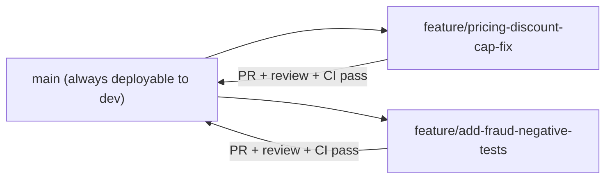

# Repository & Branching Strategy

**Purpose:** Define repository layout, branching model, and code review
requirements — consistent across every repository in this platform
(shared library, per-job repos, Terraform, DAGs).
**Owner:** Cloud/DevOps.

---

## Repository layout

| Repository | Contents |
|---|---|
| `data-platform-spark-common` | Shared Spark library (per [`07-spark-migration/01-repository-restructuring.md`](../07-spark-migration/01-repository-restructuring.md)) |
| `data-platform-<job-name>` (one per job, or one per job family if using dynamic DAG generation) | Job code, tests, config |
| `data-platform-terraform` | All Terraform modules and environment configuration (per [`13-infrastructure/01-terraform-folder-structure.md`](../13-infrastructure/01-terraform-folder-structure.md)) |
| `data-platform-dags` | Composer DAGs, organized by data domain (per [`04-target-architecture/06-orchestration-architecture.md`](../04-target-architecture/06-orchestration-architecture.md)) |

## Branching model: trunk-based with short-lived feature branches

Simplified GitFlow, favoring trunk-based development over long-lived
`develop`/`release` branches — matching the fast-iteration needs of a
migration program with hundreds of jobs to move:

- **`main`** is always in a deployable state (auto-deployed to `dev` per
  [`13-infrastructure/05-environment-promotion.md`](../13-infrastructure/05-environment-promotion.md)).
- **Feature branches** are short-lived (days, not weeks), named
  `feature/<short-description>` or `fix/<short-description>`.
- **No long-lived `develop` branch** — this avoids the merge-conflict and
  drift problems of classic GitFlow at this program's scale and pace.
- **Release tags** (not release branches) mark what's promoted to
  `qa`/`stage`/`prod`, per
  [`06-environment-promotion-and-release.md`](06-environment-promotion-and-release.md).

## Pull request requirements

| Requirement | Enforcement |
|---|---|
| At least one approving review | Branch protection rule, no exceptions |
| CI checks passing (tests, lint, format) | Branch protection rule, required status checks |
| For shared library changes: two approving reviews | Given the wide blast radius established in [`07-spark-migration/README.md`](../07-spark-migration/README.md) |
| For Terraform changes affecting `prod`: Security Engineering review if IAM/KMS/network related | Required reviewer group |

## Code review focus areas

Reviewers explicitly check for (not just "does it work"):

- No hardcoded values (per
  [`07-spark-migration/05-configuration-management-and-secrets.md`](../07-spark-migration/05-configuration-management-and-secrets.md)).
- Idempotency preserved (per
  [`07-spark-migration/07-idempotency-design.md`](../07-spark-migration/07-idempotency-design.md)).
- Test coverage for new/changed logic.
- No secrets committed (enforced additionally by automated secret
  scanning in the pipeline, per
  [`03-spark-job-pipeline.md`](03-spark-job-pipeline.md)).

## Common Mistakes

- Allowing long-lived feature branches that drift significantly from
  `main`, creating large, hard-to-review merge conflicts.
- Merging with CI failing "temporarily" with intent to fix later —
  branch protection should make this structurally impossible, not just
  discouraged by convention.

## Production Notes

For any repository touching Tier 1 job code or shared infrastructure,
enforce the two-reviewer requirement without exception — this is a hard
branch protection rule, not a guideline that can be bypassed under
schedule pressure.
