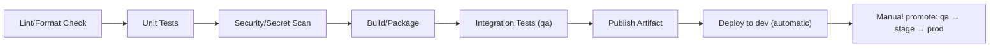

# Pipeline Architecture

**Purpose:** Define the CI/CD tool choice and overall pipeline stage
design shared across every pipeline type in this platform.
**Owner:** Cloud/DevOps.

---

## Tool choice: GitHub Actions (primary), Cloud Build (alternative)

This playbook uses **GitHub Actions** as the primary CI/CD tool, given
its tight integration with the GitFlow-lite branching model in
[`01-repository-and-branching-strategy.md`](01-repository-and-branching-strategy.md)
and broad team familiarity. **Cloud Build** is a fully viable alternative
with tighter native GCP integration (no service account key management
needed for GCP API access) — if the company's existing CI/CD tooling
standard is Cloud Build, substitute it directly; the pipeline *stages* and
*gates* defined in this folder apply identically regardless of which
executes them.

## Authentication from GitHub Actions to GCP

Using **Workload Identity Federation** (per
[`10-security/02-service-account-strategy.md`](../10-security/02-service-account-strategy.md))
— GitHub Actions exchanges its OIDC token for short-lived GCP credentials,
never storing a downloaded service account key as a GitHub secret:

```yaml
- id: auth
  uses: google-github-actions/auth@v2
  with:
    workload_identity_provider: 'projects/.../locations/global/workloadIdentityPools/github-pool/providers/github-provider'
    service_account: 'svc-ci-cd-deploy@acme-data-platform-shared-services.iam.gserviceaccount.com'
```

## Common pipeline stages (all pipeline types)



Every pipeline type (Spark job, Terraform, DAG) follows this same overall
shape, with type-specific detail in
[`03-spark-job-pipeline.md`](03-spark-job-pipeline.md),
[`04-terraform-pipeline.md`](04-terraform-pipeline.md), and
[`05-dag-deployment-pipeline.md`](05-dag-deployment-pipeline.md).

## Secret scanning

Every pipeline includes an automated secret-scanning stage (e.g.,
`gitleaks` or GitHub's native secret scanning) — a hardcoded credential
committed despite code review should still be caught mechanically before
merge, as defense in depth beyond human review.

## Pipeline failure handling

A failing pipeline stage **blocks** progression to the next stage and
blocks PR merge (for pre-merge stages) or deployment (for post-merge
stages) — no stage is "advisory only" for anything gating `prod`.

## Common Mistakes

- Running integration tests only in a later manual step instead of as an
  automated pipeline stage, allowing a broken change to merge before
  integration issues are caught.
- Storing a GCP service account key as a GitHub secret instead of using
  Workload Identity Federation, creating a long-lived credential exposure
  risk.

## Production Notes

Pipeline execution logs for every `prod`-bound stage are retained per the
audit requirement in
[`10-security/05-audit-logging.md`](../10-security/05-audit-logging.md) —
configure log retention explicitly, don't rely on the CI/CD tool's default
retention window if it's shorter than the compliance requirement.
