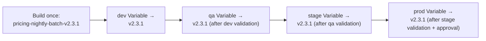

# Environment Promotion & Release Strategy

**Purpose:** Define versioning, tagging, and rollback for artifacts
(Spark job packages, shared library, DAGs) — the release-management layer
sitting above the individual pipelines in this folder.
**Owner:** Cloud/DevOps.

---

## Semantic versioning (recap and application)

Per
[`07-spark-migration/04-packaging-and-dependency-management.md`](../07-spark-migration/04-packaging-and-dependency-management.md),
every artifact uses `MAJOR.MINOR.PATCH`. The release pipeline:

1. Determines version bump from PR labels (`breaking`, `feature`, `fix`)
   or an explicit `BREAKING CHANGE:`/`feat:`/`fix:` commit convention
   (Conventional Commits).
2. Tags the merge commit: `v2.3.1`.
3. Publishes the artifact under that exact version.

## Environment promotion via version reference update

Promoting a version from `qa` to `stage` to `prod` is a **configuration
change**, not a rebuild — the same immutable artifact (e.g.,
`pricing-nightly-batch-v2.3.1`) is referenced by updating the relevant
Composer Variable
(per
[`09-composer-migration/06-variables-connections-and-secrets.md`](../09-composer-migration/06-variables-connections-and-secrets.md))
in each environment, never rebuilt per environment — this guarantees the
exact same tested artifact reaches `prod` as was tested in `qa`/`stage`.



## Rollback pipeline

Rolling back a bad release means reverting the environment's Variable to
the prior known-good version — no rebuild needed, since the prior
version's artifact remains available in Artifact Registry/GCS per the
retention policy in
[`07-spark-migration/04-packaging-and-dependency-management.md`](../07-spark-migration/04-packaging-and-dependency-management.md):

```bash
# Rollback: revert the Composer Variable to the prior version
gcloud composer environments run prod-composer \
  --location us-central1 \
  variables set -- pricing_job_version v2.3.0
```

This rollback mechanism is dedicated pipeline functionality (a
one-command rollback trigger), not a manual, error-prone process
improvised during an incident — see
[`21-cutover/06-rollback-plan.md`](../21-cutover/06-rollback-plan.md) for
when this is invoked during a cutover-specific rollback.

## Release notes

Every tagged release auto-generates release notes from commit messages
(Conventional Commits enables this automatically), stored alongside the
release in the repository and linked from
[`documentation/`](../documentation/README.md) for any release affecting
a Tier 1 job.

## Common Mistakes

- Rebuilding an artifact per environment instead of promoting the same
  immutable build — this breaks the "tested exactly what's deployed"
  guarantee that makes promotion trustworthy.
- Not maintaining enough historical artifact versions in Artifact
  Registry/GCS to support a meaningful rollback window (e.g., garbage
  collecting versions too aggressively).

## Production Notes

Maintain at least the last 5 versions of every Tier 1 job's package and
the shared library in Artifact Registry — a rollback target that's been
garbage-collected away is not actually available when needed.
