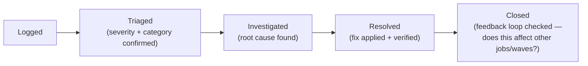

# Issue Tracker (Process & Format)

**Purpose:** Define how issues are tracked across the program — this
document defines the *process and required fields*, not a live issue
list (which belongs in an actual tracking tool — Jira/Linear/GitHub
Issues — per the note in
[`00-project-overview/04-timeline-and-phases.md`](../00-project-overview/04-timeline-and-phases.md)
about the migration tracker needing to be a live tool, not a static
document).
**Owner:** Migration Program Lead.

---

## Issue categories

| Category | Examples | Typically Logged During |
|---|---|---|
| Dependency gap | Missing/unresolved dependency found | [`02-dependency-analysis/`](../02-dependency-analysis/README.md) |
| Test failure | Unit/integration/regression test failure | [`15-testing/`](../15-testing/README.md) |
| Validation discrepancy | Reconciliation check failure | [`16-data-validation/`](../16-data-validation/README.md) |
| UAT finding | Business-identified issue | [`20-uat/04-issue-tracking-and-resolution.md`](../20-uat/04-issue-tracking-and-resolution.md) |
| Hypercare issue | Post-cutover issue | [`22-hypercare/02-issue-management-process.md`](../22-hypercare/02-issue-management-process.md) |
| Infrastructure issue | Terraform/pipeline failure | [`ci-cd/`](../ci-cd/README.md) |

## Required fields (every issue)

| Field | Purpose |
|---|---|
| ID | Unique identifier |
| Category | Per the table above |
| Severity | P1/P2/P3, per [`22-hypercare/02-issue-management-process.md`](../22-hypercare/02-issue-management-process.md) severity definitions (used consistently program-wide, not just during hypercare) |
| Affected Job/Domain | |
| Description | |
| Root Cause | Once investigated |
| Resolution | |
| Related Phase Document | Which phase document's process should be strengthened, if this reveals a systemic gap |
| Status | Open / In Progress / Resolved / Deferred |

## Issue lifecycle

## Systemic issue escalation

Any issue whose root cause suggests a gap in a shared component (the
shared Spark library, the validation framework, a Terraform module) is
flagged explicitly to the Migration Program Lead, per the "feeding
findings back" principle established in
[`16-data-validation/`](../16-data-validation/README.md) and
[`22-hypercare/02-issue-management-process.md`](../22-hypercare/02-issue-management-process.md)
— a systemic issue found once should inform every subsequent wave, not
just get fixed locally.

## Common Mistakes

- Tracking issues informally in Slack threads instead of the actual
  tracker, losing the searchable record and the systemic-pattern
  visibility a consolidated tracker provides.
- Closing an issue once the immediate symptom is fixed without confirming
  root cause was actually addressed (versus just working around the
  symptom).
