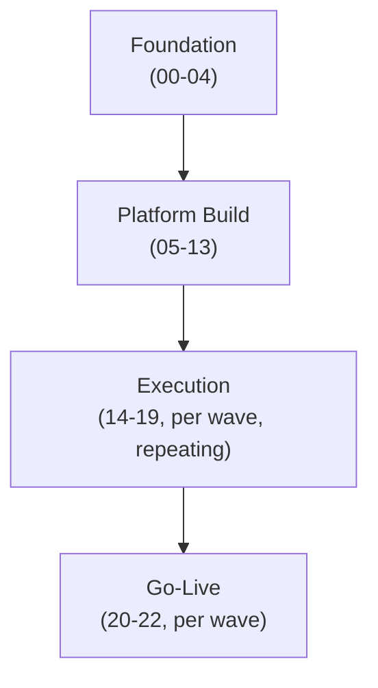

# Project Plan

**Purpose:** The consolidated, program-level project plan — pulling
together the phase timeline, wave plan, and resourcing into one reference,
complementing the phase-by-phase detail in
[`00-project-overview/04-timeline-and-phases.md`](../00-project-overview/04-timeline-and-phases.md)
and
[`14-job-migration/02-wave-planning.md`](../14-job-migration/02-wave-planning.md).
**Owner:** Migration Program Lead.

---

## Program structure

## Resourcing model

| Phase Group | Primary Resources |
|---|---|
| Foundation | Program Lead, Platform Eng, Security, Network — full team engaged |
| Platform Build | Platform Eng, Cloud/DevOps, Security, Network — building shared infrastructure once |
| Execution (per wave) | Data Eng (job migration), QA (testing), rotating through waves |
| Go-Live (per wave) | Full command center per [`21-cutover/02-command-center-operations.md`](../21-cutover/02-command-center-operations.md), then hypercare team |

## Milestones

| Milestone | Gate Criteria | Target |
|---|---|---|
| Foundation complete | Phases 00-04 gated per [`00-project-overview/04-timeline-and-phases.md`](../00-project-overview/04-timeline-and-phases.md) | |
| Platform build complete | Phases 05-13 gated | |
| Pilot wave (Wave 0) complete | Per [`14-job-migration/02-wave-planning.md`](../14-job-migration/02-wave-planning.md) | |
| 50% of jobs migrated | Tracker-derived | |
| All Tier 1 jobs migrated | Tracker-derived | |
| On-prem decommissioned | Per [`05-storage-migration/07-rollback-procedure.md`](../05-storage-migration/07-rollback-procedure.md) decommissioning gate | |
| Program closeout | Per [`22-hypercare/06-lessons-learned-and-closeout.md`](../22-hypercare/06-lessons-learned-and-closeout.md) | |

_(Populate target dates once [`01-discovery/`](../01-discovery/README.md)
produces real job/table counts — see the explicit caution in
[`00-project-overview/04-timeline-and-phases.md`](../00-project-overview/04-timeline-and-phases.md)
against publishing dates before that data exists.)_

## Dependencies on external parties

| Dependency | Owner | Status |
|---|---|---|
| GCP landing zone / organization setup (if not already existing) | Cloud/DevOps + IT | |
| Network connectivity provisioning (VPN/Interconnect) | Network Engineering | Per [`11-network/05-hybrid-connectivity-vpn-interconnect.md`](../11-network/05-hybrid-connectivity-vpn-interconnect.md) |
| Budget approval | Executive Sponsor / Finance | Per [`00-project-overview/02-migration-charter.md`](../00-project-overview/02-migration-charter.md) |

## Reporting

Per [`00-project-overview/04-timeline-and-phases.md`](../00-project-overview/04-timeline-and-phases.md)
status reporting cadence, using
[`templates/status-report-template.md`](../templates/status-report-template.md).
