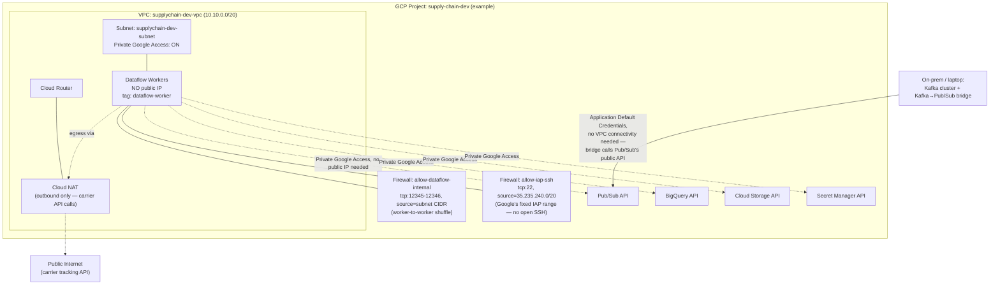

# Network Diagram

Each environment (dev/uat/prod) gets its own GCP project (recommended — see
`infra/terraform/environments/*/terraform.tfvars.example`) and, within it,
its own VPC — environment isolation here is project-level, not just a VPC
boundary within a shared project. That matters because IAM, quotas, and
billing are all project-scoped in GCP; a shared project with per-env VPCs
would still let a dev Terraform mistake touch prod's IAM policy.

## Design decisions worth defending

**No public IPs on Dataflow workers.** Set via `--disable-public-ips` in
`scripts/deploy_dataflow_pipeline.sh`. Workers reach every GCP API they
need (Pub/Sub, BigQuery, GCS, Secret Manager) via **Private Google
Access**, enabled on the subnet
(`infra/terraform/modules/networking/main.tf`) — a public IP per worker
would mean each autoscaled worker is a potential internet-facing surface
for zero benefit, since nothing needs to reach a worker from the internet.

**Cloud NAT exists for exactly one reason:** the shipment enrichment
transform (`dataflow/transforms/enrich_shipment.py`) is the pipeline's only
call to a third-party service outside GCP's network. Without NAT, workers
with no public IP would have no path to the public internet at all —
NAT provides outbound-only connectivity without giving workers inbound
reachability.

**SSH access goes through IAP, not a public IP + open port 22.**
`35.235.240.0/20` is Google's own fixed range for Identity-Aware Proxy TCP
forwarding — this firewall rule allows SSH tunneled through IAP (which
itself enforces IAM + optional context-aware access) and nothing else.
There is no rule allowing SSH from `0.0.0.0/0` anywhere in this network.

**The Kafka cluster and bridge are intentionally outside this VPC
entirely.** They run wherever the "on-prem" side of this simulation runs
(a laptop, or a separate on-prem network in a real deployment) and reach
Pub/Sub over its public API using Application Default Credentials — this
models the realistic seam between something IT already runs today and the
cloud platform, rather than requiring a VPN/Interconnect for a component
that doesn't need one.
