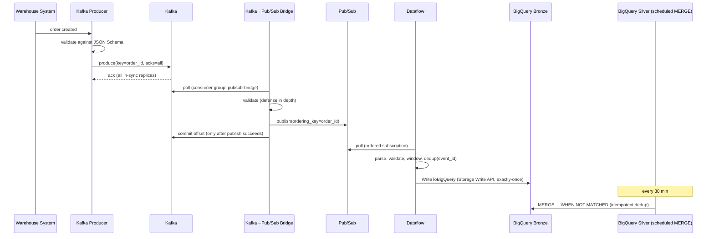
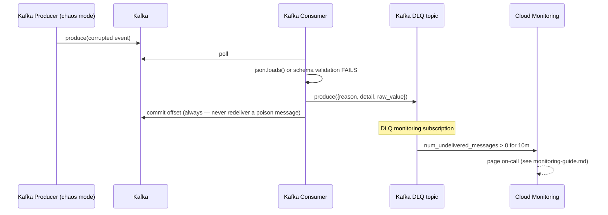

# Sequence Diagrams

## 1. Happy path — a single order event, end to end



## 2. DLQ path — a malformed event



## 3. Replay / backfill from the GCS raw archive

```mermaid
sequenceDiagram
    participant Archive as GCS Raw Archive
    participant Batch as Batch Beam Pipeline (replay)
    participant BQ as BigQuery Bronze
    participant Silver as BigQuery Silver

    Note over Archive: Kafka retention (7-14d) has long since expired;<br/>GCS archive is the only remaining source
    Batch->>Archive: ReadFromText(gs://.../<domain>/*.jsonl)
    Batch->>Batch: same parse/validate/dedup transforms as streaming
    Batch->>BQ: WriteToBigQuery (WRITE_APPEND — Bronze is append-only)
    Note over Silver: next scheduled run picks up the backfilled rows
    Silver->>BQ: MERGE ... WHEN NOT MATCHED (safe to re-run — event_id dedup)
```
